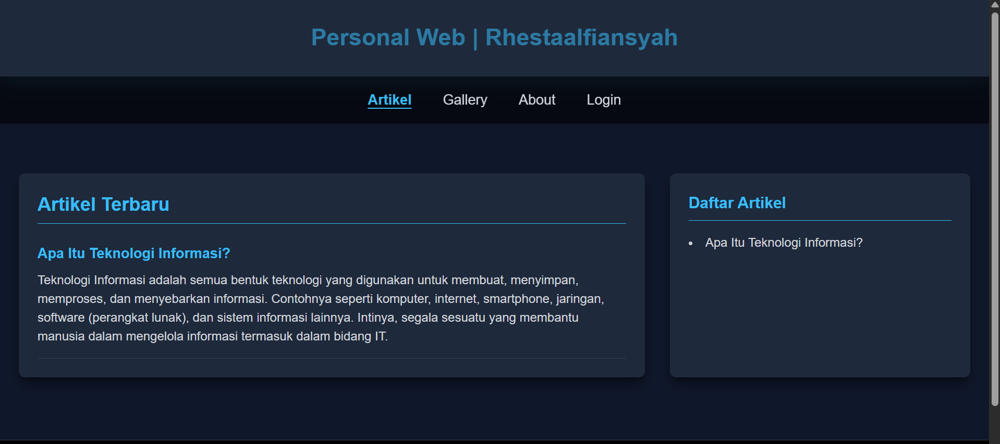
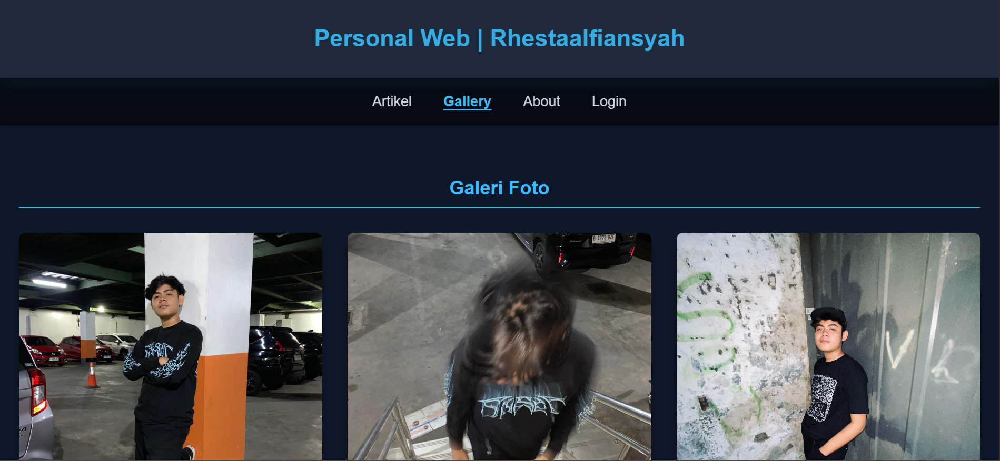
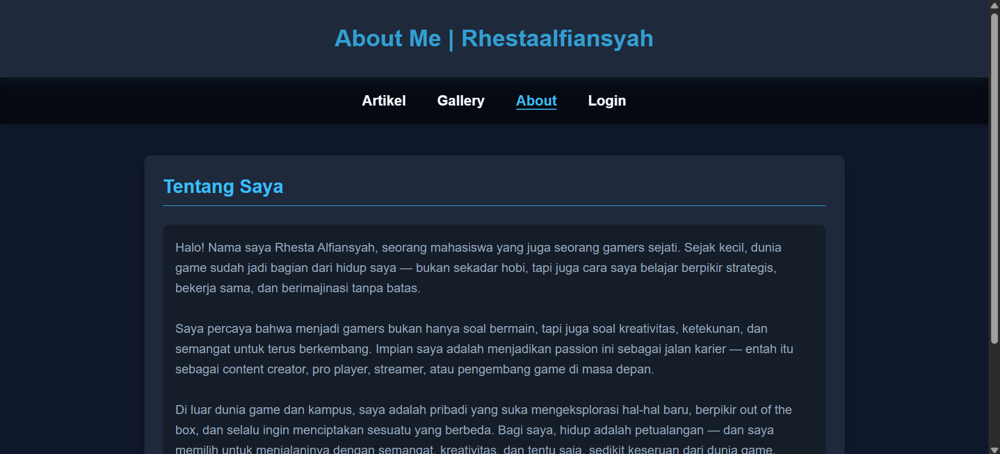
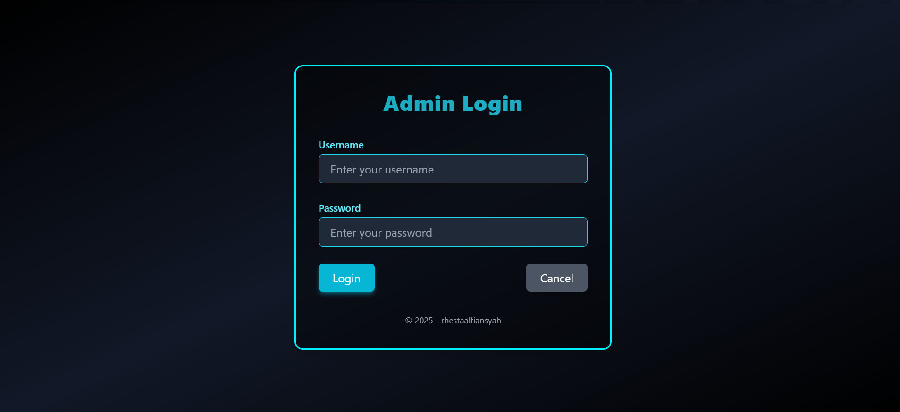
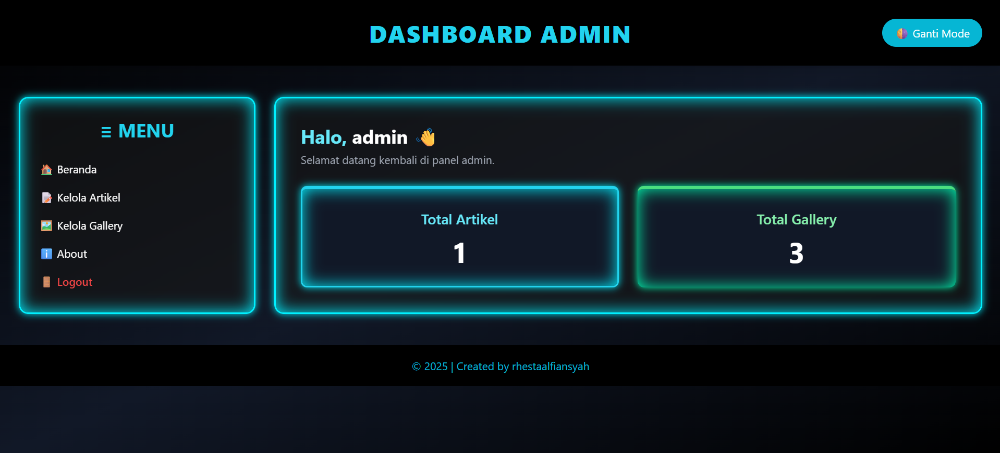
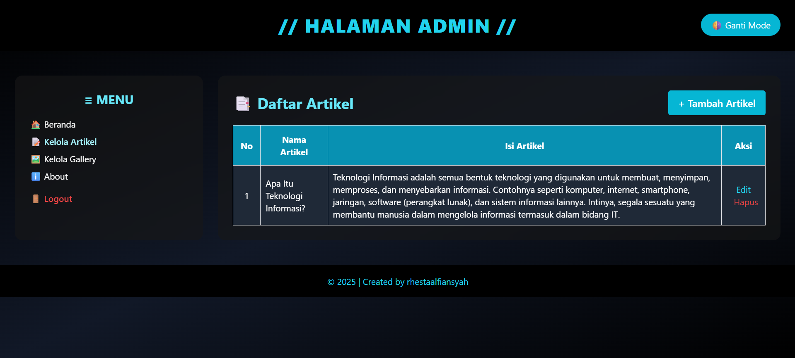
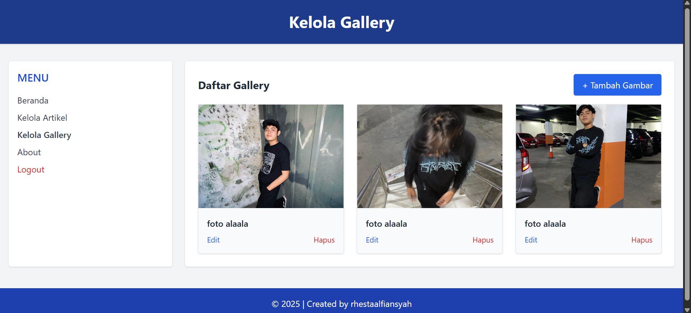

# 🌐 Personal Web | Rhesta Alfiansyah

Berbagi cerita, ide, dan inspirasi melalui tulisan dan galeri pribadi.  
Dibuat sebagai proyek pembelajaran menggunakan PHP, Tailwind CSS, dan MySQL.

---

## 📌 Deskripsi Proyek

Website ini adalah personal web milik Adam Faturrachman yang menampilkan artikel pribadi, galeri foto, dan fitur admin untuk mengelola konten. Web ini bertujuan menjadi ruang ekspresi dan latihan praktis membuat web dinamis.

---

## ✨ Fitur-Fitur Aplikasi

### 📝 Halaman Publik
- Beranda / Artikel Terbaru  
  Menampilkan artikel terbaru dan daftar artikel.

- Galeri Foto  
  Galeri publik dengan momen pribadi.

- About (Tentang Saya)  
  Profil dan penjelasan singkat tentang pemilik web.

- Login Admin  
  Login untuk mengakses dashboard admin.

---

### 🛠 Halaman Admin
- Dashboard Admin  
  Menampilkan total artikel dan galeri.

- Kelola Artikel  
  Tambah, edit, dan hapus artikel.

- Kelola Galeri  
  Tambah, edit, dan hapus gambar galeri.

- Kelola About  
  Edit halaman tentang saya.

- Logout  
  Keluar dari halaman admin.

---

## 📷 Screenshot Tampilan

### 1. Artikel  

### 2. Galeri Foto  

### 3. Tentang Saya  

### 4. Form Login Admin  

### 5. Dashboard Admin  

### 6. Kelola Artikel 

### 7. Kelola Gallery 

---

## 🧰 Teknologi yang Digunakan

- Frontend: HTML5, Tailwind CSS v4.0  
- Backend: PHP Native  
- Database: MySQL  
- Web Server: XAMPP / Localhost

---

## 📁 Struktur Folder
├── admin/
│   ├── about.php
│   ├── add_about.php
│   ├── add_artikel.php
│   ├── add_gallery.php
│   ├── beranda_admin.php
│   ├── cek_login.php
│   ├── data_artikel.php
│   ├── data_gallery.php
│   ├── delete_about.php
│   ├── delete_artikel.php
│   ├── delete_gallery.php
│   ├── edit_about.php
│   ├── edit_artikel.php
│   ├── edit_gallery.php
│   ├── login.php
│   ├── logout.php
│   ├── proses_add_about.php
│   ├── proses_add_artikel.php
│   ├── proses_add_gallery.php
│   ├── proses_edit_about.php
│   ├── proses_edit_artikel.php
│   └── proses_edit_gallery.php
│
├── images/
├── about.php
├── gallery.php
├── index.php
└── koneksi.php
│
└── uploads/
